# Examen Parcial - Estructuras de Datos

## Información del Estudiante

- **Nombre:** Wilson Oswaldo Vivar Solís
- **Carné:** 202502391
- **Curso:** Estructuras de Datos
- **Catedrático:** Ing. Brandon Chitay

---

## Descripción del Proyecto

Este proyecto implementa una **Lista Doblemente Enlazada Circular** en Java, una estructura de datos avanzada donde cada nodo contiene referencias tanto al nodo anterior como al siguiente, formando un ciclo continuo. La implementación permite insertar y eliminar elementos desde el inicio o final de la lista, buscar elementos específicos e imprimir el contenido completo.


### Características principales:

- **Estructura Circular:** El último nodo apunta al primero y el primero apunta al último, permitiendo recorrido continuo en ambas direcciones.
- **Operaciones Fundamentales:**
  - Inserción al inicio
  - Inserción al final
  - Eliminación al inicio
  - Eliminación al final
  - Búsqueda de elementos
  - Impresión de la lista
  
- **Menú Interactivo:** Interfaz de usuario intuitiva que permite realizar todas las operaciones de forma ordenada.

- **Control de Errores en Entrada:** Se implementó validación de datos con manejo de excepciones para evitar que el programa se rompa cuando el usuario ingresa datos tipo string en lugar de números enteros. La función `leerEntero()` en `Main.java` captura entradas inválidas y solicita reingresar el dato.

---

## Video Explicativo

[Enlace al video]

---

## Instrucciones de Compilación y Ejecución

### Compilación

Ejecute el siguiente comando en la terminal desde el directorio del proyecto:

```bash
javac Nodo.java ListaDobleCircular.java Main.java
```

### Ejecución

Después de compilar, ejecute:

```bash
java Main
```

### Descripción de Archivos

| Archivo | Descripción |
|---------|-------------|
| `Nodo.java` | Clase que define la estructura de un nodo con dato y referencias anterior/siguiente |
| `ListaDobleCircular.java` | Implementación de todas las operaciones de la lista doblemente enlazada circular |
| `Main.java` | Menú interactivo funcional con todas las opciones y validación de entradas |

---

## Resultados

1. Vista del menú principal al iniciar el programa.

    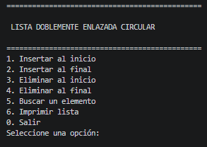

2. Ejemplo de varias inserciones al inicio y al final.

    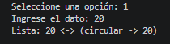 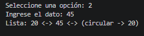 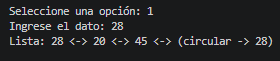 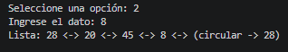

3. Ejemplo de eliminación al inicio y al final.

    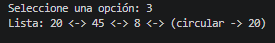 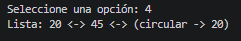

4. Ejemplo de búsqueda de un elemento.

    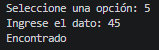 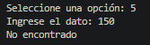

5. Ejemplo de impresión de la lista completa.

    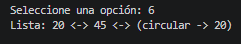

6. Ejemplo de manejo de entrada inválida.

    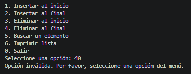 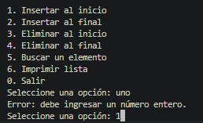 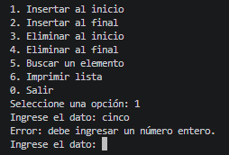

7. Ejemplo des salida limpia del programa.

    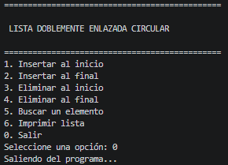

---

## Notas Técnicas

- El programa valida automáticamente las entradas del usuario, evitando excepciones por datos inválidos.
- La lista puede almacenar múltiples elementos idénticos.
- Las operaciones de búsqueda recorren la lista completa en estructura circular.
- El programa finaliza limpiamente al seleccionar la opción "Salir" (0).

## Conclusiones propias
La lista doblemente enlazada circular es útil para almacenar datos que deben recorrerse de manera continua y en ambos sentidos. Se aplica en menús circulares, reproductores de música, turnos rotativos, carruseles de imágenes y juegos por rondas, donde al llegar al último elemento se vuelve al primero automáticamente.

He aprendido que es conveniente utilizar este tipo de estructura cuanddo se requiere un acceso eficiente a los elementos de la lista desde el inicio como al final. He logrado entender como funciona la relación de los nodos entre sí, y de como se pueden insertar, eliminar y buscar elementos en la lista.

## Referencias de ayuda para la realización del proyecto
Promt de ChatGPT para la implementación de la lista doblemente enlazada circular, la base para el correcto desarrollo del código del proyecto esta en el algoritmo que se tiene de referencia del PDF para el examen parcial #2.

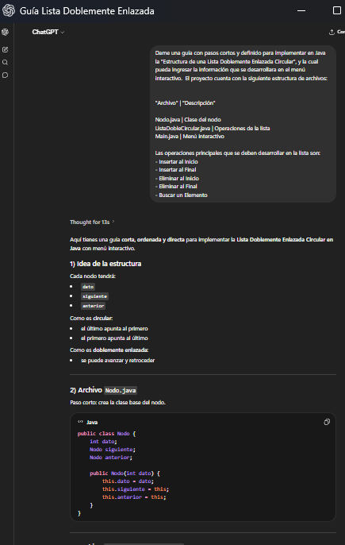

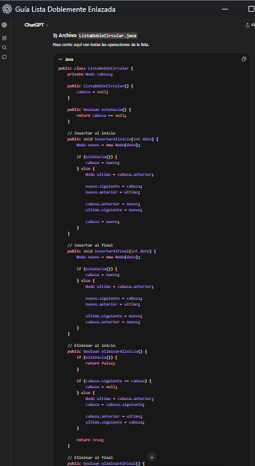
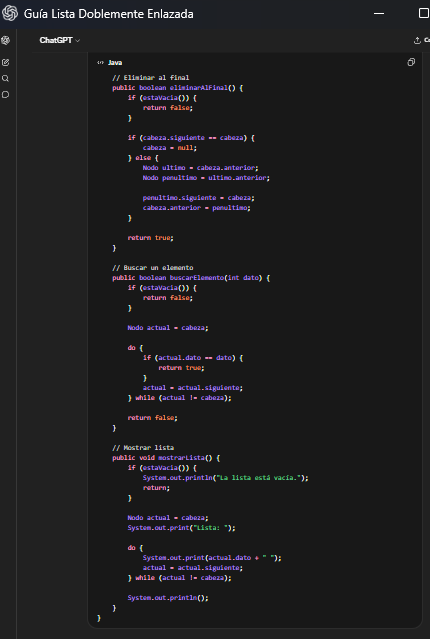